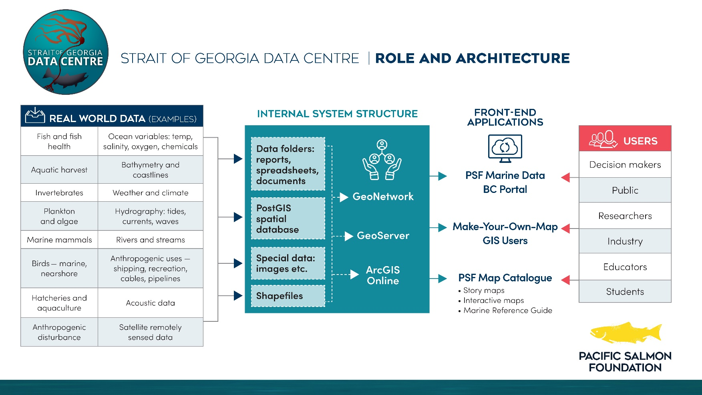

**Purpose:**

This document describes the basic functionality of GeoNetwork and how it fits in within the Data Centre’s processes. GeoNetwork is a free, open-source catalog application. It is designed to enable access to georeferenced databases, cartographic products, and related metadata from a variety of sources. This enhances spatial information exchange and sharing between organizations and audiences.

GeoNetwork provides metadata search and editing functions, as well as an interactive map viewer. Its easy-to-use web interface allows users to search geospatial data across multiple catalogs. When conducting a search, GeoNetwork looks at the entire metadata record rather than just keywords. This makes the process of refining searches and finding records of interest rather efficient. Online editing of metadata is based on a template system and directories of information (i.e. contacts, thesauri). The editor provides uploading of data, graphics, pdf files, and any other content type. Also, the interactive map viewer based on OpenLayers provides access to OGC services (WMS, WMTS) and standards (KML, OWS). It is connected to the catalog, which makes it easier for users to find new services, layers, and even dynamic maps to use together. User maps can be annotated, printed, and shared with others.

Last, GeoNetwork contains monitoring and reporting tools that provide summarized information about the content of the catalog and statistics on the search. The system maintainer (Terry) can easily access the system status.

**Key Features:**

- Multilingual metadata editing,

- Validation system,

- Suggestion to improve metadata quality,

- Geopublication of layers to publish geodata layers in OGC services (eg. GeoServer)

**More Info:**

<https://geonetwork-opensource.org/>

**SGDC GeoNetwork Workflow:**
